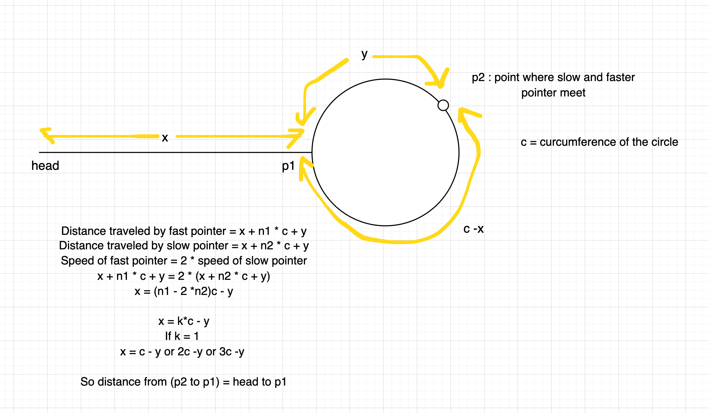

# Fast and Slow Pointer (Floyd's Cycle Detection)

## Core Concept

Two pointers moving at different speeds:
- **Slow**: moves 1 step at a time
- **Fast**: moves 2 steps at a time

**Key Insight**: If there's a cycle, fast will eventually catch slow inside the cycle.

---

## Pattern 1: Detect Cycle

**Algorithm**:
1. Start both pointers at head
2. Move slow by 1 step, fast by 2 steps
3. If fast becomes null → no cycle
4. If slow meets fast → cycle exists

**Complexity**: O(n) time, O(1) space

---

## Pattern 2: Find Cycle Start (Head of Cycle)

**Algorithm**:
1. **Phase 1**: Detect cycle (fast catches slow)
2. **Phase 2**: Reset one pointer to head, move both at **same speed** (1 step each)
3. Where they meet = cycle start

**Complexity**: O(n) time, O(1) space

### Visual Diagram

**Why it works?**

Distance from head to cycle start = Distance from meeting point to cycle start

**Mathematical Proof**:
- **x** = distance from head to cycle start (p1)
- **c** = circumference/length of the cycle
- **y** = distance from cycle start (p1) to meeting point (p2)

When they meet at p2:
- Slow traveled: `x + y`
- Fast traveled: `x + n1*c + y` (n1 complete cycles)
- Since fast = 2 × slow: `2(x + y) = x + n1*c + y`
- Simplifies to: `x = n1*c - y`
- Which means: `x = c - y` (when n1 = 1) or `x = 2c - y` (when n1 = 2)

**Key Insight**: Moving x steps from meeting point (p2) to cycle start (p1) = Moving x steps from head to cycle start (p1)

So distance from p2 to p1 = head to p1!

---

## Common Use Cases

| Pattern | Description | Pointer Movement |
|---------|-------------|------------------|
| **Detect Cycle** | Check if cycle exists | slow: 1 step, fast: 2 steps |
| **Find Cycle Start** | Find where cycle begins | Phase 1: detect, Phase 2: same speed |
| **Find Middle** | Get middle element | slow: 1 step, fast: 2 steps (stop when fast ends) |
| **Nth from End** | Find nth node from end | fast moves n steps ahead first |
| **Palindrome Check** | Check if list is palindrome | Find middle, reverse second half, compare |

---

## Key Patterns at a Glance

### 1. Cycle Detection
- Move slow (1) and fast (2) until they meet or fast ends
- Meeting → cycle, Fast ends → no cycle

### 2. Find Middle
- Move slow (1) and fast (2) until fast reaches end
- Slow will be at middle

### 3. Nth from End
- Move fast n steps ahead
- Move both together until fast ends
- Slow is at nth from end

### 4. Find Duplicate in Array [1,n]
- Treat array as linked list: index → arr[index]
- Apply cycle detection (duplicate creates cycle)

---

## Critical Points

- **Null checks**: Always verify `fast != null && fast.next != null`
- **Phase 2 speed**: Both move at **same speed** (1 step), not different
- **Reset location**: Reset to head, not null
- **Why 2x speed?**: Guarantees meeting in cycle, optimal for detection

---

## Problems to Practice

- [x] [Linked List Cycle II](https://leetcode.com/problems/linked-list-cycle-ii/) - Medium
- [x] [Remove nth Node from End](https://leetcode.com/problems/remove-nth-node-from-end-of-list/) - Medium
- [ ] [Find Duplicate Number](https://leetcode.com/problems/find-the-duplicate-number/) - Medium
- [ ] [Palindrome Linked List](https://leetcode.com/problems/palindrome-linked-list/) - Easy
